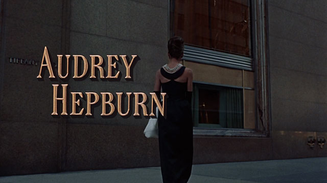
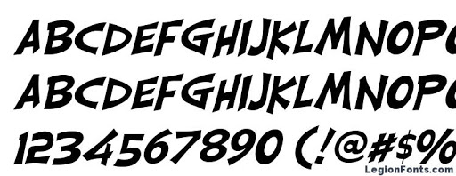
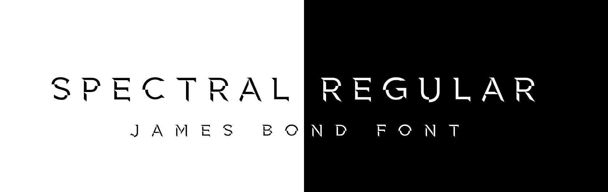

In the last 60 years, from the premiere of the iconic Sound of Music, to the more modern James Bond, typography styles in films have changed significantly. In the late 1960's, when both Breakfast At Tiffany's and the Sound of Music were produced, the hand-written style of typography, such as the font called "Engravers" was particularly popular. In the below article I am going to be analysing the way in which typography has changed since then, and the possible reasons behind this.

http://annyas.com/screenshots/updates/breakfast-at-tiffanys-1961-movie-typography/

When looking at film posters and the opening scenes from films produced in the late 60's, such as Breakfast at Tiffany's, it is clear to see how a very relaxed, handwritten and welcoming typography was used back in the time period. However, when comparing this font choice to more recent films, the typography in the more modern ones, such as the 007 James Bond movie, they often appear more processed and manufactured, unlike the authentic, traditional style from films in the 60's.

**Typography in the 1960's**

As seen in the example below of The Sound of Music typography, the font appears very genuine and handwritten. The exact font that used is called " Carlisle Italic". 

https://fanart.tv/movie/15121/the-sound-of-music/

 When analysing this type of typography, it can be presumed that the purpose of using a typography like this is to create a sense of familiarity and comfort for audience, making them recognise the authentic style of the typography, and therefore automatically view the film as a down to earth, iconic family classic. 

**Typography in the Present Day**

However, when comparing the typography to a film from the present day, such as one of James bond's films, it is immediately obvious that there are several differences between the two era's typography's, and this allows us to explore the way in which typography has developed and changed over the years. As seen in the examples below, the typography choices for the Spectre film are very modern, almost appearing as if it have been edited and digitally constructed on a computer. Fonts differ and there are several used, however one example that looks similar is called "Spectrum Regulator" by Sostopher. 

https://ivanblagojevic.com/2015/11/james-bond-spectre-fonts-free/

This type of typography has the effect on the audience of making the film appear like an action film, through the modern and abstract choices of typography. 

This is shown by the slightly jagged edges of the lettering, and the broken up, fractured letters not being cohesive, signifying the idea that the film is of a quick pace nature, and contains threat and danger. This example is very significant when it comes to looking at how a certain type of typography can instantly give away themes and the genre of the film to the audience, without them even needing to watch the movie.

https://www.dafont.com/forum/read/194925/007-spectre-font

**Overall Comparison and Analysis**

When looking at the typography from the two different time periods, there is no doubt that typography has expanded and grown massively in the space of the past 60 years. Whereas handwritten,  more authentic looking fonts used to be used in order to make the audience comfortable and recognise the familiarity in the film, more niche, quirky styles of typography are now being used in the 21st century, in order to keep up with the ever evolving times, and keep audiences more engaged and involved in newer, more dynamic styles of films.