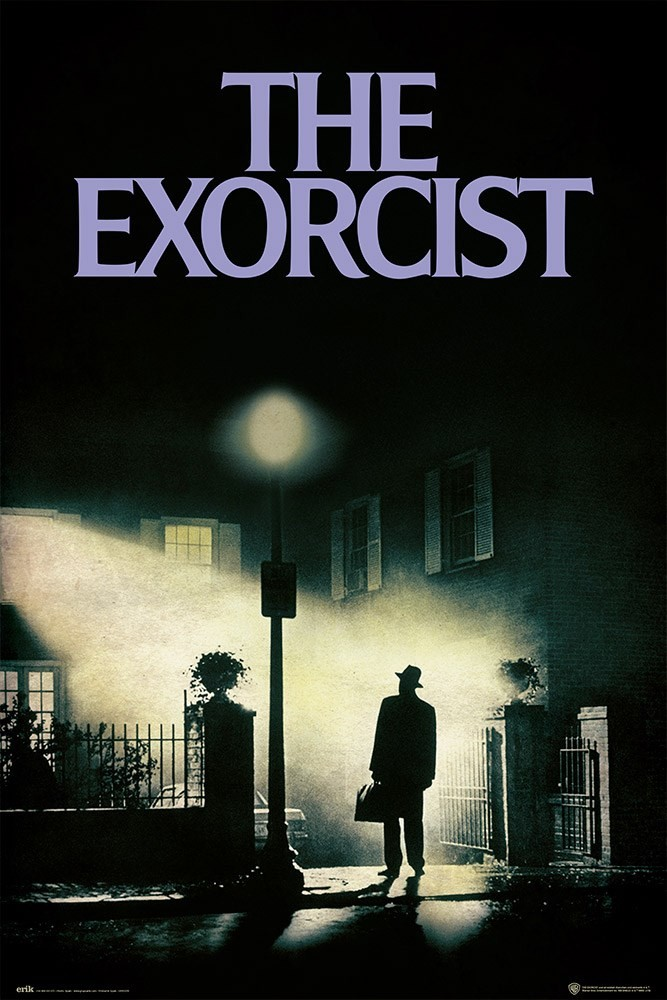

Regardless of which film genre you prefer to watch, whether it's romance, fiction, horror or comedy, the typography in every genre of film differs significantly. In this blog I will be comparing the differences in typography between romance films and horror films, and the reason behind these specific choices.

Whether you enjoy watching chick-flicks with your friends, find the light heartedness amusing after a few drinks, or are simply an emotional girl cradling some ice-cream going through a breakup, romance films have been around since the late 1890's. Proving some easy comedic relief, they are often known to be "easy watchers", and are an all year round favourite. They often feature gentle typography choices that are smooth and easy on the eye, often mimicking the plot of the story. Romance films can also feature a lot of decorative, delicate, and intricate details in their typography, such as thin lettering and swirls on the end of letters. However, they are also very asthetically pleasing to look at, with all the letters being the same thin width and height. The first example of typography in the romance genre that I will be analysing is the iconic Rachael McAdam's film, The Notebook.

**Comparing the Typography choices in Romance Films to Horror films**

The Notebook

https://fontmeme.com/the-notebook-font/

At first glance, the typography used to advertise and promote the movie, and to depict the tone of the film before even watching it, can appear quite plain and lacklustre. However, when looking at it closer, we can notice that they have specifically chosen the font "Largo SB-Light". With all the letters being of the same height, thickness and width, we are lulled into a sense of comfort and security that the film will be enjoyable and non dramatic. This style of font doesn't stand out, and is neither bold, nor urgent, giving us, an audience, the automatic, subconscious impression that the style of the film will be relaxed, easy to watch, and light-hearted, echoing this style choice of typography.

https://www.whatfontis.com/Largo-SB-Light-OT.font

When comparing the typography used in The Notebook, a romance film, to that used in a film in the horror genre, such as The Exorcist, the many differences in style choices are instantly recognizable. The film poster for the Exorcist uses the typography choice named "Neo Argonaut 2", which is relatively high in contrast, and has a lot of serifs on the letters, such as on the "T".

https://www.imdb.com/title/tt0070047/

When analysing the style of font, it is easy to see how the typography choice instantly puts the audience on edge. Being rather thin and quite tall, we aren't given much feeling of comfort or security regarding the type of film that is being advertised, putting the audience immediately on the foot that the film is full of uneasiness. When looking closer at the font, the serifs add a feeling of threat to the film, with the pointy edges almost highlighting a sense of danger due to their sharpness and shape. 

https://fontmeme.com/the-exorcist-font/

When comparing the 2 very different types of font used in the 2 different genre's, it is unmistakeably clear to see how a specific choice of typography can reflect the mood and tone of the film, without the audience even needing to see the imagery on the poster. This can clearly be seen by the relaxing, easy on the eye font used to advertise The Notebook, in comparison to The Exorcist, whose sharp and jarring typography choices automatically created a sense of distrust and threat about the film.