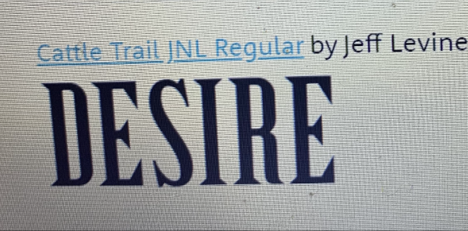
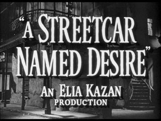
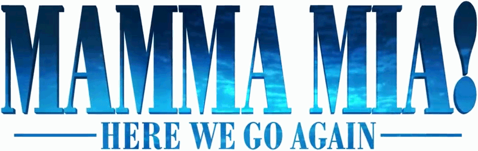
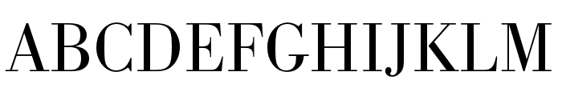

The creation of films in colour, as opposed to black and white, was a very significant turning point in the world of artistic creation. Up until the early 1950's, television entertainment was solely in black and white. I will be analysing and comparing the way in which typography and calligraphy differ when used in black and white films, as opposed to films in colour. I will do this by analysing the movie poster for the film noir A Streetcar Named Desire, to two very colourful and vibrant movie adverts, Mamma Mia and The Holiday.

**Comparing Typography in Black and White Films to Colour.**

The film A Streetcar Named Desire, which originally was a play, is a 1951 American drama film, starring Marlon Brando. Being set in this era, like other other black and white drama movies of this generation, the typography choices made often reflect the time period which the film represents. The typography used in these black and white films are often quite bold visually, to mimic the dramatic nature of black and white films, with the font being strong and the letters heavily emphasized. This also creates a sense of ambiguity as we are not automatically shown the genre of the film from the typography choices. An example of this can be seen below, where the font "Cattle Trail JNL Regular" by Jeff Levine is used for the poster of the film A Street Car Named Desire. 

As seen in the poster, the font choice is very strong, with the serif's adding drama to the title, and therefore highlighting how the nature of the film will probably dramatic too.

**In Comparison to Typography Styles in Colour Films**

In order to compare the differences in typography in the two different styles of films, I will be using the very vibrant in colour films, Mamma Mia and The Holiday as examples.

**Mamma Mia**

Being a fun family classic, the 2008 film Mamma Mia, which also originated from a play, features lively and energetic typography choices. This can be seen in the film's front cover used for advertising, where the font has been based off of the serif typeface called "Bodoni Poster Compressed". The unique font is designed to look modern and upbeat, foreshadowing the themes and moods that run throughout the film. The thick, bubble style letters generate feelings of excitement and anticipation from the audience about what the film is going to be about. When compared to the font used in the black and white film example, the typography can be seen to portray the film in a more enthusiastic, dynamic way.

**The Holiday**

It can also be useful to compare black and white film typography to a different genre, such as a romantic comedy. The 2006 film The Holiday is an American feel good comedy, starring Cameron Diaz and Jude Law, and again has a vibrant and upbeat typography style. The exact font used in the poster below is called "Bodoni SB Roman" and is  a commercial one. Again, it looks fresh, artistic and exciting when compared to the black and white dramatic film title, encouraging the audience to feel energised and positive about watching the movie.

When comparing films noir to films in colour from the modern day, it can be clear to see that the key differences vary in the purpose of the typography. The black and white title seeks to dramatize the film, and create feelings of suspense and ambiguity for the audience, whereas films in colour use typography to highlight clearly to the audience the genre of the film, such as Mamma Mia being feel good and upbeat due to the thick, bubble font, and The Holiday being romantic and comedic through it's handwritten, artistic style.