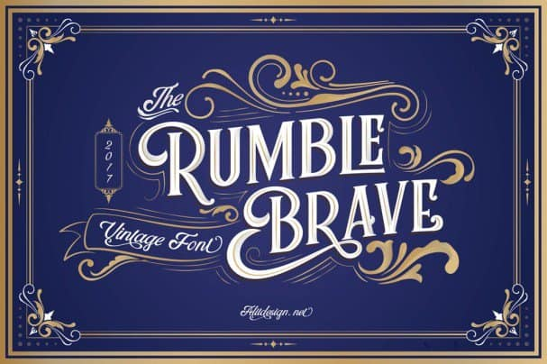
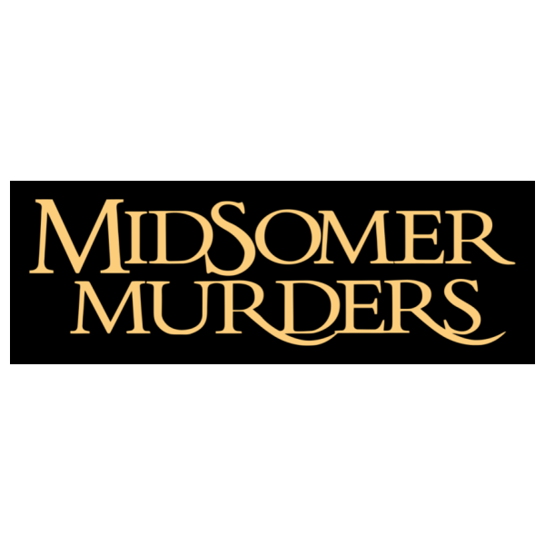
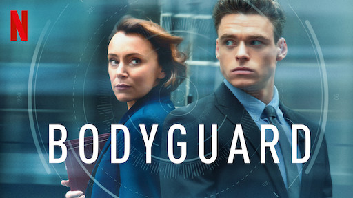

With original series on the rise, such as Emily In Paris on Netflix and the BBC's The Bodyguard, there are several ways that typographies are used in series, in order to create specific messages and emotions about the series to the audience. In order to look on a deeper level at different typographies and their varying effects, I will be analysing 3 different series from 3 different years - Emily In Paris, Midsummer Murders, and The Bodyguard.

**Emily In Paris**

Being a brand new Netflix show that only released 6 weeks ago, the comedic and light-hearted series features an American girl who moves to Paris to start a new life. However, when looking at and analysing the typography used in the series, as well as in the poster to advertise it, there are several reasons why the producer chose the particular font design.

The font used in Emily In Paris is a modification of the font Rumble Brave, an example can be seen below.

The typography shown above looks refreshing, fun, and almost fairytale story book like, due to the swirls and serifs on letters such as on the letter R. This choice of typography is very cuccessful when used in Emily In Paris, due to it exposing the fun, comedic and light-heartedness themes in the series to the Netflix audience.

**Midsummer Murders**

Another series I will be analysing in terms of typography is Midsummer Murders. Beginning in 1987, it is the oldest series that I will be comparing. Proudly boasting 21 seasons, the mystery classic is extremely popular. To advertise the series and for the title on television, the series uses the font called "Trajan Bold" and is a serif font, designed by Carol Twombly. An example of the font can be seen below.

The outstroke serifs on some letters such as "R" and "S" create a mythical, medieval tone about the series. Being coupled with the fact that the series is labelled as a "mystery drama", the dramatic, sweeping old fashioned typography is very effective at emphasising the genre and tone of the series, and therefore captivating and engaging an audience immediately.

**The Bodyguard**

Having only 6 episodes, the drama series, The Bodyguard, has only been around for a couple of years, and has just been put onto Netflix. Unlike the series Emily In Paris and Midsummer Murders, The Bodyguard fits into several different genre categories, such as action, crime and romance, meaning the typography in the series doesn't portray the theme of the series as clearly or effectively as the two other series I am analysing. The font used to advertise the show, and for the title, is called "URW DIN Arabic Semi Condensed Medium by Type Foundry" as seen below.

The slim, low contrast letters imply a mysterious, ambiguity about the series, which is also reflected by the startled looks on the character's faces behind in the poster. However, unlike the other two typographies from series that we analysed, it is clear to see how The Bodyguard's doesn't have the same purpose as the typography in Emily in Paris or Midsummer Murders. Instead of signifying to the audience what the series is about and it's genre, The Bodyguard instead seeks to create further mystery, and perhaps anticipation, about what the series is about in order to engage it's audience through not using forthcoming, obvious typography.