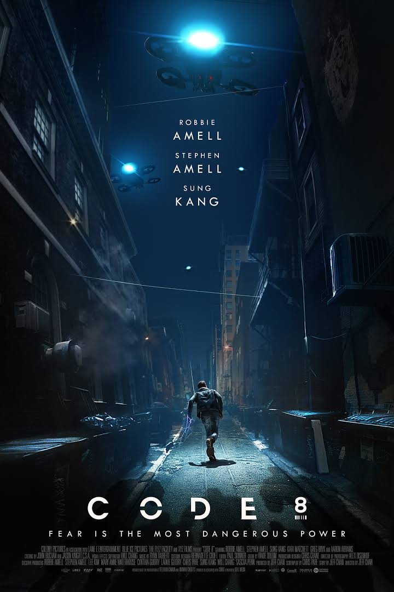
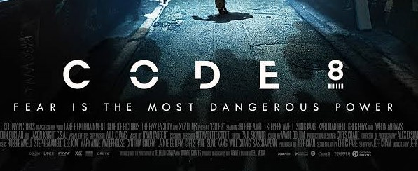
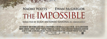

With 2/5 of people liking Sci-Fi movies, the genre has been growing rapidly in popularity over recent years. However, when comparing and analysing the typography used in this genre, to it's polar opposite, true life, reality movies, a lot can be learned about the way in which typography is used to create meanings and messages for their audiences, and the many reasons behind this, for example, foreshadowing events in the film.

**Code 8**

The film I will be using to analyse and compare Sci-Fi genre film typography is the popular 2019 film Code 8. Focusing on a young but desperate man who has powers, the film was a success and scored an impressive 90% rating on the review site Rotten Tomatoes. The typography I will be analysing is the font used for advertisement, and the font used for the poster for the film. An example of the poster can be seen below.

The exact typography used for the film is called "Diode Black" by Burghal Design. However, for the title of the film, some letters have been made to be missing some parts of the letters and appear fractured, as evident with the letters "O" and the bottom right of the letter "D". Through having some letters broken up, the nature of the film is also foreshadowed to the audience, giving them the impression that the film is also going to revolve around a supernatural force being present in the film, due to the abnormality of having broken letters. It also highlights how the protagonist male character, in the poster, will face disruption and drama too. 

**The Impossible**

Although produced in 2012, The Impossible is based on an infamous true story - the 2004 Boxing Day tsunami, that killed over 230,000 people. The film centres around a real life family dynamic being torn apart by the event, along with the gory details about injury, separation, heartbreak. For this comparison, I will be analysing the typography used in the film poster, as seen below.

The exact typography used in the poster is named "Weiss Medium", a serif deigned in 1926 by Emil Rudolf. The high contrast, wide letters stand out and are unmistakable due to being written in capital letters instead of lower case. This implies a sense of urgency and misery to the audience, giving them the idea that the true story film is going to be dramatic, disturbing, and action packed. This can also be inferred from the red font colour. 

When comparing the 2 different types of typographies, in Sci-Fi films and true story films, it can be concluded that the types of typographies play very different roles due to their genre. The Sci-Fi typography is very fractured and abnormal with cut up letters, leading it's audience to look towards the supernatural elements in the film, whereas the true story film instead attempts to appeal to people's emotions, through the dramatic and wide letters conveying a sense of danger and threat to the audience's normality.