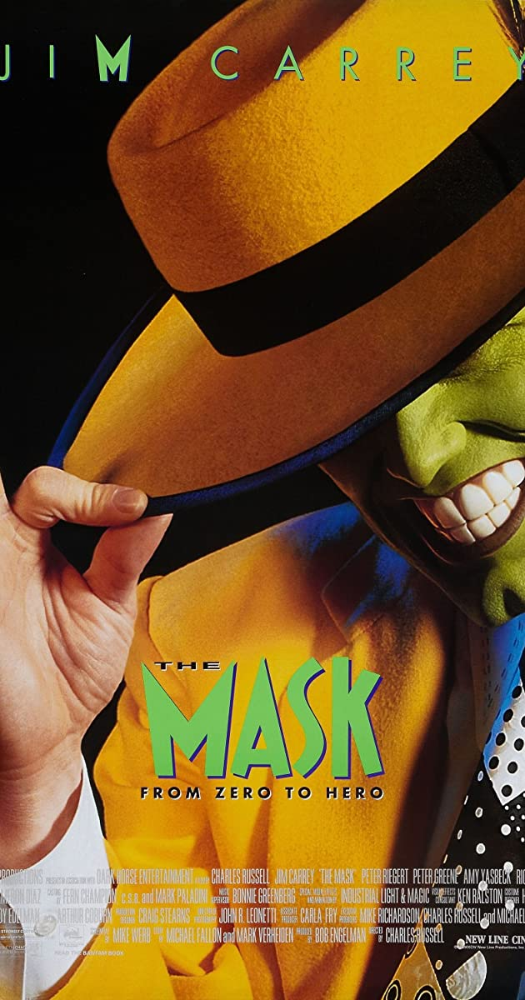

Being the nations favourite genre of film, after action, the comedy sector seeks to bring humour, happiness, and light hearted relief to it's audience. In my next blog I will be looking at the ways in which different typographies are used in this film genre and for what purpose, and will be using the high rated comedic films "The Mask" and "Meet The Fockers" to assist me with this analysis.

