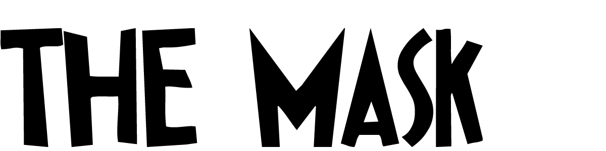
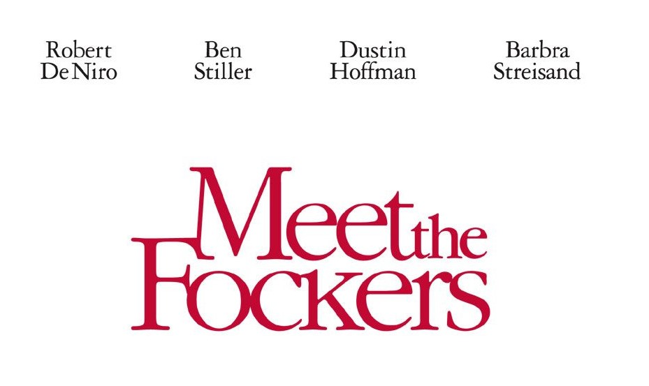

Being the nations favourite genre of film, after action, the comedy sector seeks to bring humour, happiness, and light hearted relief to it's audience. In my next blog I will be looking at the ways in which different typographies are used in this film genre and for what purpose, and will be using the high rated comedic films "The Mask" and "Meet The Fockers" to assist me with this analysis.

**The Mask**

The 1994 slapstick comedy, The Mask, stars Jim Carrey, and centres around a bank employee who is able to change reality. The eccentric, quirky film uses a font that is also out of the box and unique, as seen in the example from  the film poster below.

The exact typography used is called Ipkiss ZF by ZF Typography. The high contrast letters foreshadow the eccentric theme that runs throughout the film. The letters have pointed edges as opposed to straight which is usually the "norm", therefore creating the impression to the audience that film is going to be jarring and unique too.

**Meet The Fockers**

Despite being from the same genre, the Adam Sandler comedy "Meet The Fockers" uses typography in very different ways when compared to The Mask. An example of this can be seen in the film advertisement poster below.

The name for this